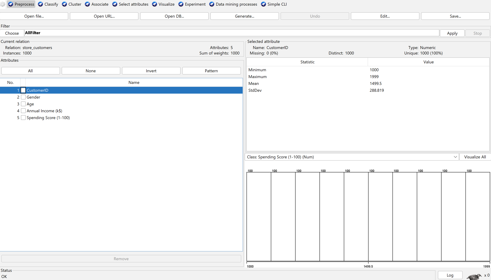
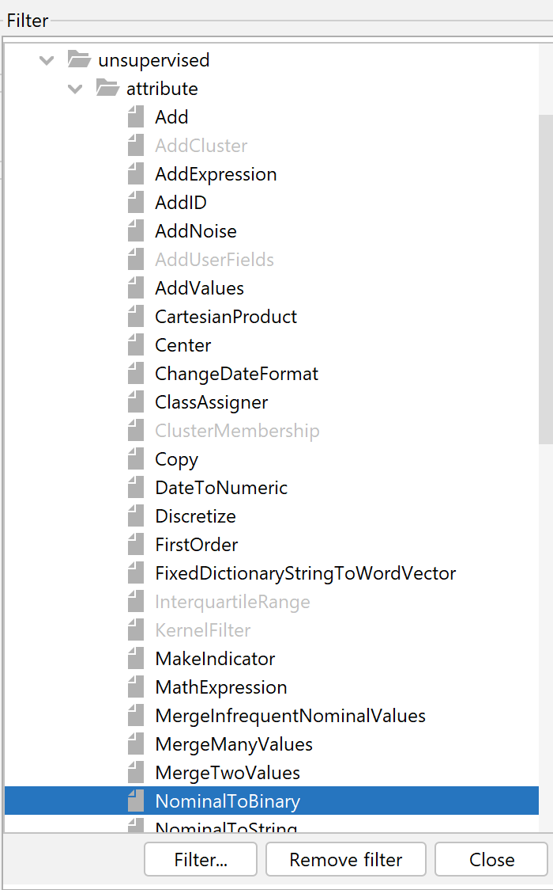
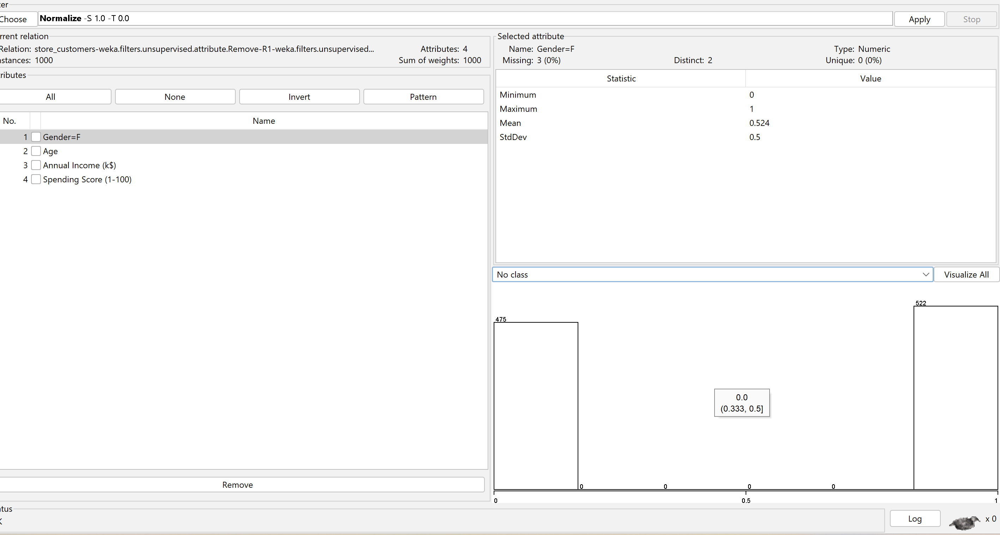
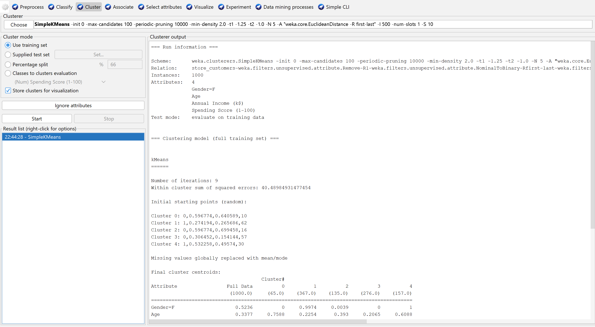
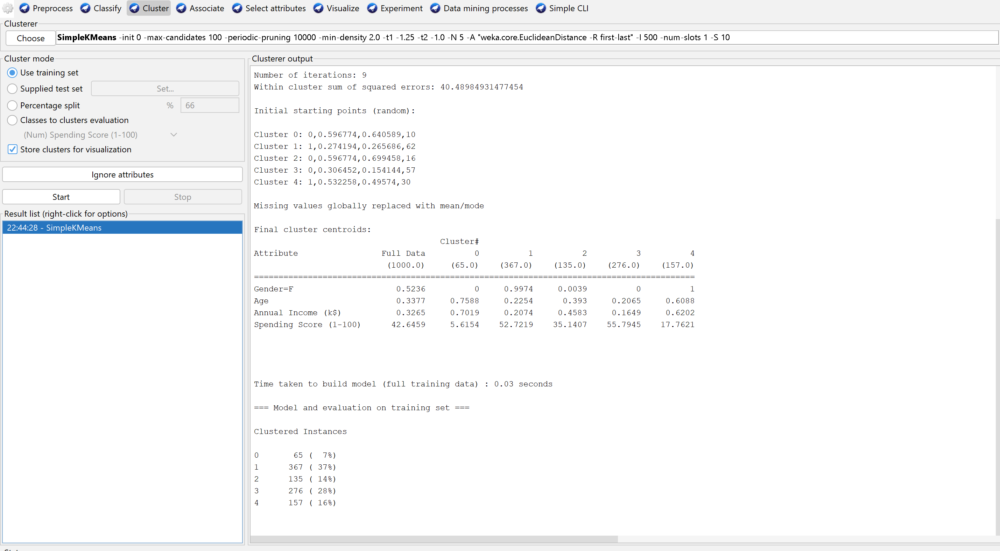
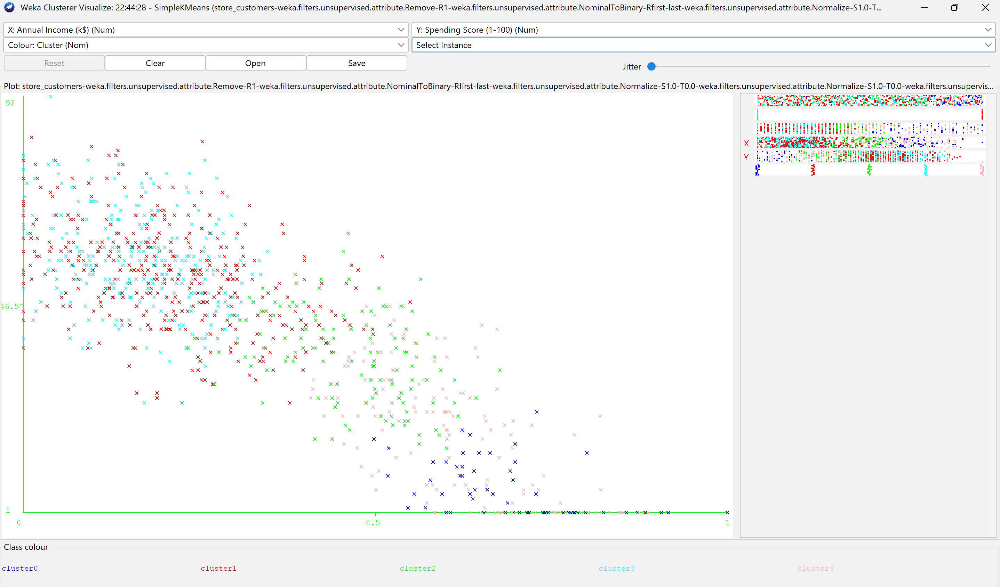

# 📊 Customer Segmentation using K-Means Clustering (WEKA)

## 🚀 Project Highlights
- Implemented K-Means clustering using WEKA
- Performed complete data preprocessing pipeline
- Identified 5 meaningful customer segments
- Derived business insights for targeted marketing strategies

---

## 📌 Overview
This project focuses on customer segmentation using the K-Means clustering algorithm in WEKA. The goal is to group customers based on their income and spending behavior to extract meaningful insights.

---

## 🎯 Objectives
- Understand data preprocessing techniques
- Apply unsupervised learning (clustering)
- Segment customers based on behavioral patterns
- Generate business insights from clustered data

---

## 🛠️ Tools & Technologies
- WEKA (Machine Learning Tool)
- K-Means Clustering
- CSV Dataset

---

## 📂 Dataset Description
The dataset contains:
- Age
- Gender
- Annual Income (k$)
- Spending Score (1–100)

---

## ⚙️ Data Preprocessing
- Removed irrelevant attribute (CustomerID)
- Converted categorical data (Gender → Numeric)
- Applied normalization (scaled between 0 and 1)
- Removed class label (unsupervised learning)

---

## 🧠 Algorithm Used
### K-Means Clustering
- Partitions data into K clusters
- K = 5 chosen based on real-world customer segmentation

---

## 📊 Results & Insights

### 🔹 Key Observations
- High income does not always mean high spending
- Customer behavior varies across segments

### 🔹 Identified Segments
- High Income – High Spending
- High Income – Low Spending
- Low Income – High Spending
- Low Income – Low Spending
- Average Customers

### 🔹 Business Insights
- Helps identify high-value customers
- Enables targeted marketing strategies
- Improves customer retention

---

## 📸 Project Screenshots

### 🔧 Data Preprocessing

### 🔄 Nominal to Binary Conversion

### 📉 Normalization

### 📊 K-Means Output

### 📍 Cluster Visualization

---

## 📄 Report
Full case study available here:  
[View Report](report/DWM_Casestudy_Indrayani.pdf)

---

## 🚀 Conclusion
This project demonstrates how clustering techniques can uncover hidden patterns in customer data. The insights generated can help businesses make data-driven decisions and improve marketing strategies.

---

## 👩‍💻 Author
**Indrayani Mude**  
Computer Engineering Student
